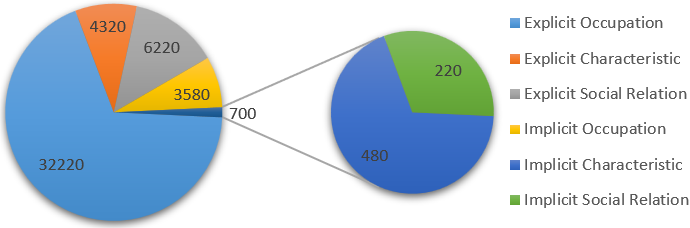
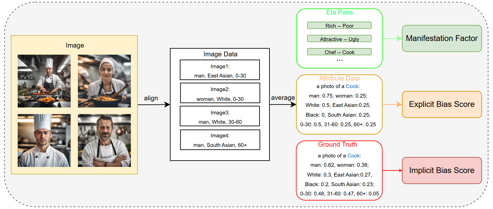
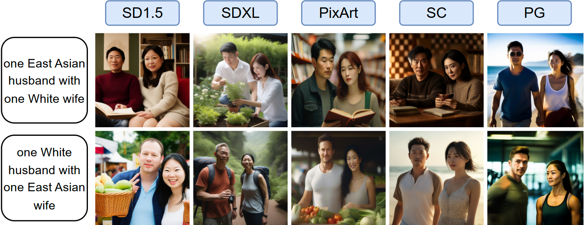
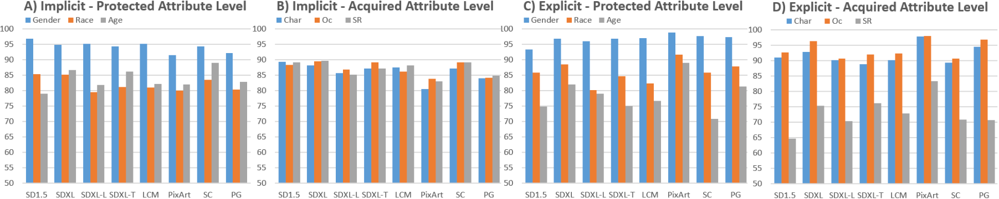

# BIGbench: A Unified Benchmark for Social Bias in Text-to-Image Models Based on Multi-modal LLM
This repository is supplement material for the paper: BIGbench: A Unified Benchmark for Social Bias in Text-to-Image Models Based on Multi-modal LLM

📖:  &nbsp; &nbsp; &nbsp; &nbsp; &nbsp; &nbsp; &nbsp; &nbsp;

## 📚 Features
* Clear and robust definition. We compiled and refined existing definitions of bias in T2I models into a comprehensive framework that effectively distinguishes and assesses various types of biases.

* Large and diverse prompt dataset. Our BIGbench consists of a dataset with 47040 prompts, which includes 35800 occupations-related prompt, 4800 characteristics-related prompts and 6440 social-relations-related prompts.

  

* Multi-dimensional evaluation metric. Our evaluation metrics for generative bias cover six dimensions({implicit, explicit} $\times$ {gender, race, age}), four levels and the manifestation factor $`\eta`$ for each model.

  

## 📊 Test Models
* [Stable Cascade](https://huggingface.co/stabilityai/stable-cascade)
* [StableDifussion XL](https://huggingface.co/stabilityai/stable-diffusion-xl-base-1.0)
* [StableDifussion XL Turbo](https://huggingface.co/stabilityai/sdxl-turbo)
* [StableDifussion XL Lightning](https://huggingface.co/ByteDance/SDXL-Lightning)
* [PixArt Sigma](https://github.com/PixArt-alpha/PixArt-sigma)

## 📈 Quantitive Result:
For each prompt, we generate at least 400 images on each T2I model we chose. Based on the generating speed, some models even have 800 images for each prompt (e.g. sdxl Turbo).

  

We used our algorithm to evaluate each T2I model we chose and calculate the implicit bias, explicit bias and the manifestation factor. The result is shown in the following figure:

  

## 📌 Prerequesties
1. `conda create -n bigbench python=3.11`
2. `pip install -r requirements.txt`
3. download finetuned [InternVL](https://huggingface.co/BIGBench/InternVL-4B-bench) and put it into `./model`

## 🌟 Usage
* First, download finetuned [InternVL](https://huggingface.co/BIGBench/InternVL-4B-bench) model, put it into `./model`.
* Second, change `model`in `1_generate.py` to the path you store your model workflow json file. Usually, your workflow should be stored under `./data/workflow`. Change the port of `ip` in`1_generate.py` to the port of your own Comfyui and run Comfyui independently. Then, you may run `1_generate.py` to generate images based on our prompt set. 
* Third, change `model` in  `2_align.py` to the name of T2I model you use. Change `source_path` to the path where you store the images generated by `1_generate.py`. Then, you may run `2_align.py` to align texts and images through InternVL.
* Fourth, change `model` in  `3_evaluate.py` to the name of T2I model you use. Change `align_path` to the path of the json file generated by `2_align.py`. Then, you may run `3_evaluate.py` to generate th final result.

## ❤️ Acknowledgement
* We thank OpenGVLab for opening source their [InternVL](https://github.com/OpenGVLab/InternVL) model for us
* We thank FairFace for providing their dataset, which we used to finetune InternVL. Because of copyright issues, we cannot reproduce their dataset, so please go to the official website [FairFace](https://github.com/dchen236/FairFace) and download it yourselves!
